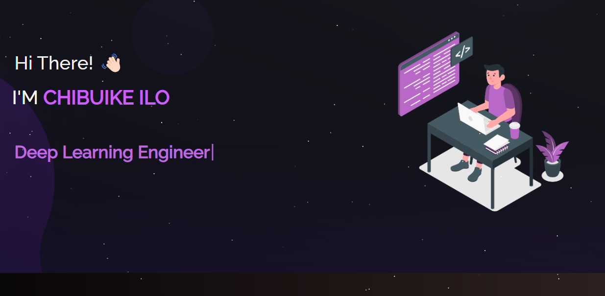

<h2 align="center">
  Portfolio Website - v2.0 
  <a href="https://westieweb-chibuike-ilo.netlify.app/" target="_blank">chibuike.tech</a>
</h2>

  

 

  
  &nbsp;
  
  &nbsp;
  

<h3 align="center">
    🔹
    <a href="https://github.com/WESTIEWEB/portfolio-sit/issues">Report Bug</a> &nbsp; &nbsp;
    🔹
    <a href="https://github.com/WESTIEWEB/portfolio-sit/issues">Request Feature</a>
</h3>

## TL;DR

This is version 2.0 of my personal portfolio [chibuike.tech](https://westieweb-chibuike-ilo.netlify.app/). You can fork this repo to modify and make changes. Please give me proper credit by linking back to [WESTIEWEB](https://github.com/WESTIEWEB/portfolio-sit). Thanks!

## Built With

My personal portfolio [ilochibuike.tech](https://westieweb-chibuike-ilo.netlify.app/) features some of my GitHub projects, resume, and technical skills.

This project was built using these technologies:

- React.js
- Node.js
- Express.js
- CSS3
- VsCode
- Netlify

## Features

- **📖 Multi-Page Layout**
- **🎨 Styled with React-Bootstrap and CSS with easy-to-customize colors**
- **📱 Fully Responsive**

## Getting Started

Clone down this repository. You will need `node.js` and `git` installed globally on your machine.

### 🛠 Installation and Setup Instructions

1. Installation: `npm install`
2. In the project directory, you can run: `npm start`

Runs the app in the development mode.\
Open [http://localhost:3000](http://localhost:3000) to view it in the browser.
The page will reload if you make edits.

## Usage Instructions

Open the project folder and Navigate to `/src/components/`.  
You will find all the components used, and you can edit your information accordingly.

### Show Your Support

Give a ⭐ if you like this website!

<!--  -->
